# 데이터 정제 보고서
## 데이터 소스
### animal_data (출처 : https://www.kaggle.com/datasets/likhon148/animal-data )
- 15종의 동물에 대해 30장씩 224 X 224 X 3 크기의 원본 이미지가 분류 되어있고,  
각 이미지에 대해 좌우반전, 명도 조절 등의 처리로 어그멘테이션 되어있다.
## 데이터 정제 필요성
- 이미지를 바로 활용하기에는 노이즈 제거 등의 전처리가 되어있지 않다.
- 추가적인 작업을 통해 원하는 형태로 좀 더 많은 수의 이미지를 복제할 수 있다.
- 가공 방식에 따라 다양한 목적으로 활용할 수 있다.
## 데이터 정제 방법
#### 파이썬에서 OpenCV를 이용해 데이터를 정제하였다. 
- cv2.flip : 영상을 좌우 혹은 상하 반전한다. 여기서는 좌우 반전만 사용하였다.  
적용 예시 
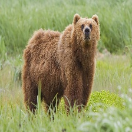
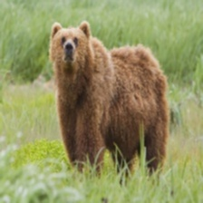  
- cv2.warpAffine : 영상에 기하학적 변환을 가한다. 5도, 10도, 15도의 회전을 적용하였다.  
적용 예시 
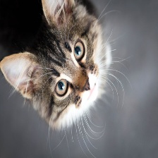
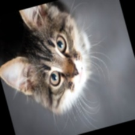  
- cv2.cv2Color : 영상의 색정보를 변환한다.  
- cv2.GaussianBlur : 가우시안 필터로 영상의 노이즈를 제거한다.  
적용 예시 
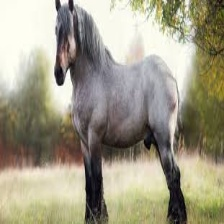
  
- cv2.threshhold : 영상 화소 값에 특정 임계기준을 정해 0과 255로 변환한다. 영상 이진화를 위해 사용했다.  
적용 예시 
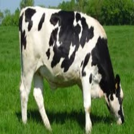
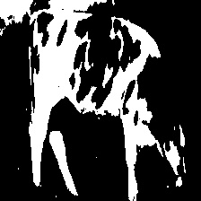  
- cv2.getStructuringElement, cv2.morphologyEx : 커널을 생성하고 픽셀 값에 컨볼루션 연산을 적용해 영상을 모폴로지 변환한다.  
적용 예시 
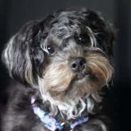
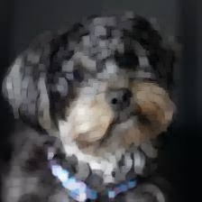  
- cv2.Laplacian : 영상에 라플라시안 필터를 적용하여 엣지를 검출한다.  
적용 예시 
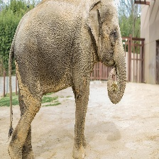
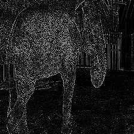
- cv2.Canny : Canny 알고리즘을 적용하여 영상에서 엣지를 검출한다.  
적용 예시 
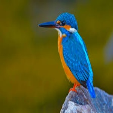
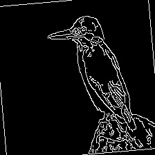  
- cv2.findContours, cv2.boundingRect, cv2.grabCut : 직사각형의 마스크 범위로 외곽선을 검출해 객체를 탐지한다.  
적용 예시 
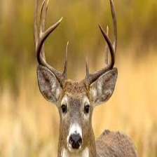
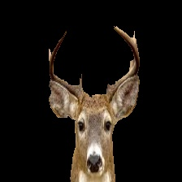  
## 결과 및 효과
### 데이터 수
- 450장의 원본 영상에 대해 기하학적 변환과 전처리를 통해 총 13495개의 영상을 만들었다. 
### 다양한 가공 형태
- 노이즈 제거, 이진화, 엣지 추출, 객체 추출 등 필요에 따라 사용할 수 있도록 다양한 형태로 가공하였다.
## 향후 계획
- 동물 분류기 학습 : 동물 영상을 통해 어떤 동물인지 분류하는 분류기를 학습시킬 수 있다.
- 동물 영상 특징 추출 : 데이터를 통해 동물 영상의 공통적인 특징 및 특징을 추출할 방법을 발전시킨다.
